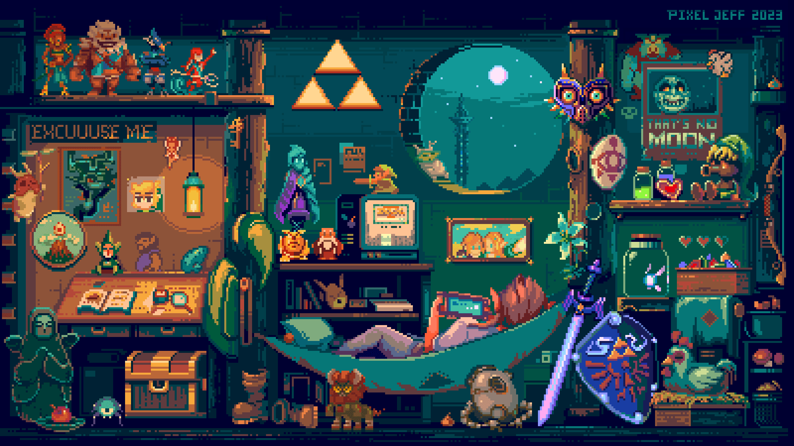

<h2 align="center">

</h2>

    
    <a href="https://skillicons.dev">
        
         
        
         
        
    </a>

    

	<picture>
	  <source media="(prefers-color-scheme: dark)"  srcset="https://raw.githubusercontent.com/rushp28/rushp28/output-3d-contrib/profile-custom-hacker.svg" />
	  
	</picture>

|  | 
&nbsp;
 |
| ------------- | ------------- |

  

